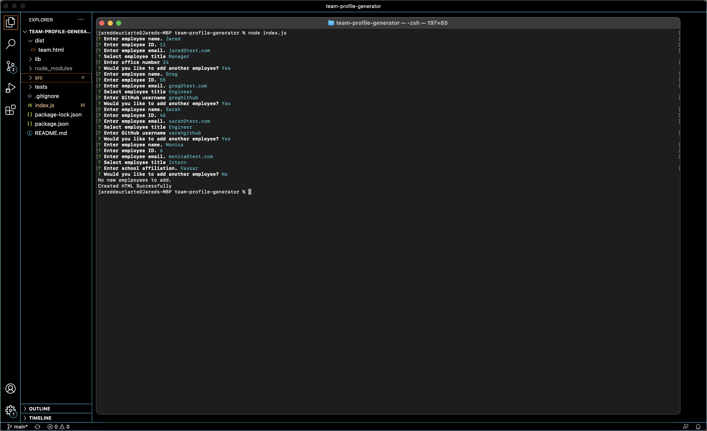
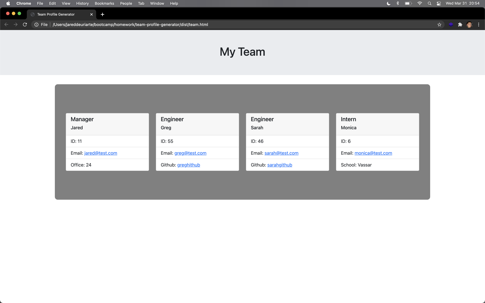

# Team Profile Generator
## Description
This command line application allows team leaders to easily register employees and create a streamlined profile to easily keep track of their team. 

## Table of Contents
- [Description](#Description)
- [Deployment](#Deployment)
- [Installation](#Installation)
- [Usage](#Usage)
- [Features](#Features)
- [Credits](#Credits)
- [Contributing](#Contributing)
- [License](#License)
  

## Deployment
- [GitHub Repo](https://github.com/jareddeuriarte/team-profile-generator)
  

  
### Installation
- Make sure Node.js is installed on your local device.
- Fork and download this repo.
   
### Usage
- Open your command line interface. 
- cd into the directory where this project is saved.
- Enter into the command line "node index.js"
- Answer the prompts accordingly.
- Voila!

### Features
- Auto-formatting
- Inquirer based input
 

### Credits  
My tutor Namita.

### Contributing
Forks are welcome!

### License 
This project is licensed under MIT.

### Badges

  
### Questions?
Reach me at:
- [GitHub](https://github.com/jareddeuriarte)
- deuriartejared@gmail.com

